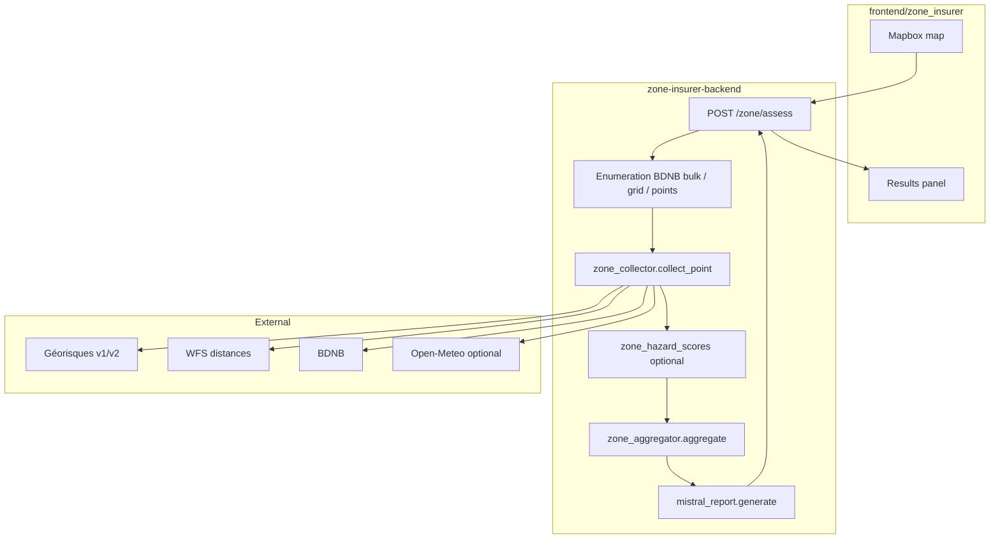

# Risk Map MVP — Implementation Plan

**Scope:** `zone-insurer-backend/` + `frontend/zone_insurer/`  
**Out of scope:** `backend/app/…` (monolith Typhoon), building-level jumeau / `risk_model.py` zones.

This document is the execution plan for: reliable zone assessment on the map, clearer data quality, optional numeric scoring, Mistral-generated narrative, prompt documentation, and a path toward richer reports (DVF, climate) without breaking the current UI.

---

## 1. Current state (baseline)

| Layer | Today |
|--------|--------|
| **API** | `POST /zone/assess` → `ZoneReport` (`app/schemas/zone.py`) |
| **Collect** | Per point: geocoding, Géorisques v1, Géorisques v2 RGA (if configured), WFS distances, BDNB (if label) — `app/services/zone_collector.py` |
| **Aggregate** | Hazard presence breakdown, CATNAT proxy totals, template narrative/reco — `app/services/zone_aggregator.py` |
| **Scores** | None at API level; `HazardInfo.score` unused |
| **Mistral** | `mistral_api_key` in config; not called |
| **Open-Meteo** | Connector exists; not wired in collector |
| **DVF / DRIAS** | Not in this package |
| **Frontend** | Tier = count of hazard *types* with `present_count > 0`; ring shows that count — `frontend/zone_insurer/app.js` |

**Known semantic gaps to fix in implementation:**

1. `catnat_totals` in aggregator counts buildings with hazard *presence*, not parsed CATNAT arrêtés by type.
2. Per-building `catnat_total` is `len(catnat_list)` but zone totals do not sum those lists consistently.
3. Collector `errors` are dropped before `ZoneReport` (UI shows `nb_errors` only when `source != live` — today all successful collects are `live` even if sub-sources failed).
4. UI label `nb_stat_flagged` uses `nb_errors` but errors are rarely incremented.

---

## 2. Target architecture



**Principles**

- **Deterministic scores** (when added) live in Python; LLM never recalculates numbers in production.
- **Degrade gracefully:** missing API key or provider failure → partial data + explicit `data_sources` / per-building `source_errors`.
- **Contract-first:** Pydantic `ZoneReport` is the API truth; prompt docs describe the same shapes.

---

## 3. Target API contract (evolution)

### 3.1 Phase A — MVP hardening (backward compatible)

Add optional fields with defaults; frontend can adopt incrementally.

```python
# app/schemas/zone.py (additions)

class SourceStatus(BaseModel):
    source: str
    ok: bool
    error: str | None = None

class BuildingHazardSummary(BaseModel):
    # existing fields...
    source_errors: list[SourceStatus] = Field(default_factory=list)
    data_quality: str = "ok"  # ok | partial | failed

class ZoneReport(BaseModel):
    # existing fields...
    aggregate_score: float | None = None      # 0-100, zone-level
    aggregate_tier: str | None = None         # faible | modere | eleve | critique
    report_schema_version: str = "1.0"
    narrative_source: str = "template"        # template | mistral
    data_sources_ok: list[str] = Field(default_factory=list)
```

### 3.2 Phase B — Scoring on hazards

Populate `HazardInfo.score` (0–100) per building; aggregator exposes `mean_score` / `max_score` per row in `HazardBreakdown` (optional fields).

### 3.3 Phase C — Context blocks

```python
class ClimateContext(BaseModel):
    reference: dict[str, Any] | None = None
    projection_2041_2050: dict[str, Any] | None = None

class FinancialContext(BaseModel):
    dvf_median_eur_m2: float | None = None
    department: str | None = None
    sample_size: int | None = None

# ZoneReport.climate_context, ZoneReport.financial_context
```

### 3.4 Phase D — “Full LLM export” (later epic)

Separate JSON schema `assessmentSchemaVersion: "2.0-llm-export"` for reinsurer tooling — **not** required for risk map MVP. Document in `docs/AI_AGENT_PROMPT_FULL.md` when Phase C data exists.

---

## 4. Scoring specification (zone MVP)

New module: `app/scoring/zone_hazard_scores.py`

**Inputs per hazard (from collector output):**

| hazard_id | Signals |
|-----------|---------|
| `rga_argile` | v2 `alea` string or v1 presence |
| `inondation` | presence + `distance_cours_eau_m` (WFS) |
| `mouvement_terrain` | presence |
| `sismique` | zone label (1–5 or text) |
| `radon` | classe 1–3 → Faible/Moyen/Élevé |
| `feu_foret` | presence + `distance_foret_m` |

**Rules (v1 — document in code docstring + `docs/SCORING.md`):**

- Map categorical levels to base points (e.g. Faible/Moyen/Élevé → 25/55/80; sismique zone 1–5 → 10/25/45/65/85).
- Proximity adjustment for inondation / feu: step function on distance (e.g. &lt; 100 m +15, &lt; 500 m +8), clamp 0–100.
- Building `score_global` = weighted max of peril scores (weights favor dominant peril: `max(perils) * 0.7 + mean(perils) * 0.3`).
- Zone `aggregate_score` = mean of building `score_global` over `nb_ok`.
- Zone `aggregate_tier` = same thresholds as frontend today but on **score** once UI switches; until then keep frontend tier on hazard count **or** switch both in same PR.

**Tier thresholds (align with frontend `ZONE_TIER` spirit):**

| Tier | Score |
|------|-------|
| faible | &lt; 30 |
| modere | 30–59 |
| eleve | 60–79 |
| critique | ≥ 80 |

---

## 5. CATNAT fix specification

**Per building (`zone_collector.py`):**

- Parse `catnat.data[]` and count by `libelle_risque_jo` keywords (same approach as monolith `risk_model._count_catnat`): inondation, sécheresse/secheresse, mouvement/éboulement/glissement.
- Expose `catnat_by_type: dict[str, int]` on internal dict; sum → `catnat_total`.

**Zone aggregate (`zone_aggregator.py`):**

- `catnat_totals` = **sum** of per-building counts by type (not hazard presence proxy).
- Keep `total` = sum of the three buckets or total arrêtés — pick one, document in `MVP_CONTRACT.md` (recommended: sum of parsed arrêtés count per type + `total_arretes`).

---

## 6. Data quality & errors

**Per building:**

- After `collect_point`, set `data_quality`:
  - `failed` if geocoding failed and no hazards
  - `partial` if any `errors[].ok == False` but some hazards returned
  - `ok` otherwise
- Copy `errors` → `source_errors` on `BuildingHazardSummary`.

**Zone-level:**

- `nb_errors` = count buildings with `data_quality == failed` OR `source != live` (define once; prefer quality-based).
- `data_sources_ok` = intersection of sources that succeeded on ≥50% of buildings (for meta display / prompts).

---

## 7. Mistral integration

### 7.1 Dependencies

Add to `requirements.txt`:

```
mistralai>=1.0,<2.0
```

### 7.2 Module: `app/services/mistral_report.py`

- Reuse pattern: sync `chat_json(system, user) -> dict` with retries (copy minimal client from `backend/app/recommandations/mistral_client.py` into `app/services/mistral_client.py` to avoid cross-package imports).
- Model: `mistral-large-latest` (configurable via settings).
- **Output schema (MVP):**

```json
{
  "narrative": "2-4 phrases, ton souscription",
  "recommendations": ["...", "..."]
}
```

- **Fallback:** current `_build_narrative` / `_build_recommendations` when no API key or parse failure.
- Set `narrative_source` on report accordingly.

### 7.3 User prompt payload

Built from aggregate dict:

- Zone summary: `nb_ok`, `nb_errors`, `aggregate_score`, `aggregate_tier` (when available)
- `hazard_breakdown` (labels, pct_present, levels)
- `catnat_totals`
- Top 5 buildings: address, `score_global`, hazards with scores, distances
- Explicit instruction: do not invent data not present in the block

### 7.4 Wire-in point

In `app/api/routes/zone.py` after `aggregate(results)`:

```python
if settings.mistral_enabled:  # new flag, default False in dev without key
    ai = await mistral_report.generate(agg)
    agg["narrative"] = ai["narrative"]
    agg["recommendations"] = ai["recommendations"]
    narrative_source = "mistral"
```

Keep aggregator pure; optional async enrichment in route or thin `report_builder.py`.

---

## 8. Prompt documentation deliverables

| File | When | Purpose |
|------|------|---------|
| `docs/MVP_CONTRACT.md` | Epic 1 | Request/response examples, hazard ids, enums |
| `docs/SCORING.md` | Epic 2 | Formulas + examples |
| `docs/AI_AGENT_PROMPT.md` | Epic 3 | System + user template for MVP Mistral I/O |
| `docs/AI_AGENT_PROMPT_LITE.md` | Epic 5 | Shorter system prompt, same JSON keys |
| `docs/AI_AGENT_PROMPT_EN.md` | Epic 5 | English instructions, French JSON keys |
| `docs/AI_AGENT_PROMPT_ZONE_PROMOTEUR.md` | Epic 6+ | Faisabilité / valeur / assurabilité when product asks |
| `docs/AI_AGENT_PROMPT_FULL.md` | Epic 7+ | 30+ field export after DVF/climate wired |

**Script:** `scripts/generate_narrative.py`

- Input: JSON file (collector + aggregate output)
- Loads prompt sections from `AI_AGENT_PROMPT.md` or embedded strings
- Calls Mistral; validates JSON keys; writes stdout

---

## 9. Open-Meteo, DVF, DRIAS (post-MVP epics)

### Epic 6 — Open-Meteo

- Call `fetch_climate` in `collect_point` (async, `_safe_call`).
- Summarize in collector: e.g. hot days &gt; 35°C/year mean 2041–2050 (simple reducer in `app/services/climate_summary.py`).
- Zone report: median/summary across buildings → `climate_context`.

### Epic 7 — DVF

- Add `app/connectors/dvf_lookup.py` (local CSV per department) + settings `dvf_lookup_dir`.
- Zone centroid department → median €/m² → `financial_context`.

### Epic 8 — DRIAS

- Add `app/connectors/drias_lookup.py` + `DRIAS_LOOKUP_PATH`.
- Department-level 2050 indicators → extend `climate_context.drias`.

Each epic: optional fields, `None` if file missing, never 500.

---

## 10. Frontend work (`frontend/zone_insurer/`)

| Task | Detail |
|------|--------|
| F1 | Use `aggregate_score` + `aggregate_tier` when present; fallback to hazard-count tier |
| F2 | Show `narrative_source` badge (“IA” vs “Règles”) |
| F3 | Building table: show per-hazard scores if `h.score != null` |
| F4 | Data quality: icon/warning if `source_errors.length` |
| F5 | CATNAT panel: align labels with fixed backend semantics |
| F6 | Export JSON already works; document `report_schema_version` in UI footer |

No Mapbox logic change required for backend epics 1–3.

---

## 11. Configuration & runbook

**`.env.example`** (create in `zone-insurer-backend/`):

```env
# Server
# uvicorn app.main:app --host 0.0.0.0 --port 8001

GEORISQUES_V2_ENABLED=false
GEORISQUES_V2_TOKEN=

MISTRAL_API_KEY=
MISTRAL_ENABLED=false

# Phase C+
# DVF_LOOKUP_DIR=./data/lookup/dvf
# DRIAS_LOOKUP_PATH=./data/lookup/drias.json
```

**README.md** (create): install, run, frontend `API_BASE`, token setup for Géorisques v2.

---

## 12. Testing strategy

| Test | File | Covers |
|------|------|--------|
| Aggregator CATNAT sums | `tests/test_zone_aggregator.py` | Fixture JSON buildings |
| Scoring clamps / tiers | `tests/test_zone_hazard_scores.py` | Level → score tables |
| Mistral fallback | `tests/test_mistral_report.py` | Mock `chat_json`, no network |
| API smoke | `tests/test_zone_assess.py` | TestClient + mocked httpx collectors |
| Golden report | `tests/fixtures/report_v1.json` | Snapshot fields after Epic 2 |

Run: `pytest` from `zone-insurer-backend/` (add `pytest`, `pytest-asyncio`, `httpx` dev deps).

---

## 13. Implementation epics & task breakdown

### Epic 1 — Contract & data quality (P0) — ~2 days

| ID | Task | Files |
|----|------|-------|
| 1.1 | Write `MVP_CONTRACT.md` with real example | `docs/` |
| 1.2 | Add `SourceStatus`, `source_errors`, `data_quality` | `schemas/zone.py` |
| 1.3 | Map collector `errors` to schema in route | `api/routes/zone.py` |
| 1.4 | Fix `nb_errors` semantics | `zone_aggregator.py`, route |
| 1.5 | README + `.env.example` | root |

**Acceptance:** POST assess returns per-building `source_errors`; partial Géorisques failure visible in JSON export.

---

### Epic 2 — CATNAT & scoring (P0) — ~3 days

| ID | Task | Files |
|----|------|-------|
| 2.1 | Parse CATNAT by type per building | `zone_collector.py` |
| 2.2 | Sum CATNAT at zone level | `zone_aggregator.py` |
| 2.3 | Implement `zone_hazard_scores.py` | `app/scoring/` |
| 2.4 | Apply scores in collector or post-process step | `zone_collector.py` or `services/scoring_pipeline.py` |
| 2.5 | Add `aggregate_score`, `aggregate_tier`, breakdown stats | `schemas/zone.py`, aggregator |
| 2.6 | Document formulas | `docs/SCORING.md` |
| 2.7 | Unit tests | `tests/` |

**Acceptance:** Each building with hazards has `score` on `HazardInfo`; zone has `aggregate_score`; CATNAT totals match sum of building arrêtés on fixture.

---

### Epic 3 — Mistral narrative (P1) — ~2 days

| ID | Task | Files |
|----|------|-------|
| 3.1 | `mistral_client.py` | `app/services/` |
| 3.2 | `mistral_report.py` + fallback | `app/services/` |
| 3.3 | Settings `mistral_enabled` | `core/config.py` |
| 3.4 | Wire in route | `api/routes/zone.py` |
| 3.5 | `AI_AGENT_PROMPT.md` | `docs/` |
| 3.6 | `scripts/generate_narrative.py` | `scripts/` |
| 3.7 | Tests with mock | `tests/test_mistral_report.py` |

**Acceptance:** With `MISTRAL_ENABLED=true` and key, narrative changes vs template; without key, identical to Epic 1 behavior.

---

### Epic 4 — Frontend alignment (P1) — ~1–2 days

| ID | Task | Files |
|----|------|-------|
| 4.1 | Score ring uses `aggregate_score` | `app.js` |
| 4.2 | Tier from `aggregate_tier` | `app.js` |
| 4.3 | Quality + narrative badge | `app.js`, optional `index.html` |
| 4.4 | Hazard scores in table | `app.js` |

**Acceptance:** Single-address assess shows numeric score when backend provides it; fallback unchanged for old responses.

---

### Epic 5 — Prompt variants (P2) — ~1 day

| ID | Task |
|----|------|
| 5.1 | `AI_AGENT_PROMPT_LITE.md` |
| 5.2 | `AI_AGENT_PROMPT_EN.md` |
| 5.3 | Script flag `--locale en|fr` / `--lite` |

---

### Epic 6 — Open-Meteo climate block (P2) — ~2 days

Wire connector, summarize, extend `ZoneReport`, document placeholders in prompt.

---

### Epic 7 — DVF + DRIAS (P3) — ~3 days

Local lookup connectors, `financial_context` / DRIAS fields, fixtures in `data/lookup/` (gitignored large files; committed samples only).

---

### Epic 8 — Full LLM export schema (P3) — ~5 days

Design `assessmentSchemaVersion 2.0`, Pydantic model, optional endpoint `POST /zone/assess/export` or query `?format=llm` — only after Epics 6–7.

---

## 14. Suggested timeline (solo dev)

| Week | Deliver |
|------|---------|
| W1 | Epic 1 + Epic 2 (CATNAT + scoring) |
| W2 | Epic 3 + Epic 4 + pytest baseline |
| W3 | Epic 5 + Epic 6 (Open-Meteo) |
| W4+ | Epic 7–8 as product priority |

---

## 15. Definition of Done (MVP release)

- [ ] `POST /zone/assess` stable under partial provider failures
- [ ] `ZoneReport.report_schema_version == "1.0"` documented
- [ ] Numeric `aggregate_score` + tier consumed by frontend
- [ ] CATNAT totals semantically correct
- [ ] Mistral optional with deterministic fallback
- [ ] `docs/MVP_CONTRACT.md`, `SCORING.md`, `AI_AGENT_PROMPT.md` committed
- [ ] `pytest` green without network
- [ ] README: run backend 8001 + frontend static server

---

## 16. Risk register

| Risk | Mitigation |
|------|------------|
| Géorisques v2 token missing | RGA falls back to v1 presence; document in `source_errors` |
| Score drift vs insurer expectations | Version `SCORING.md`; bump `report_schema_version` on formula change |
| Mistral latency on large zones | Cap buildings in prompt (top 5 + aggregate stats only); timeout + fallback |
| BDNB bulk timeout | Existing grid fallback; show `enumeration_method` in UI |

---

## 17. Immediate next steps (start here)

1. Create branch `feature/risk-map-mvp-scoring`.
2. Implement **Epic 1.2–1.4** (schema + errors) — smallest diff, unblocks honest UI.
3. Implement **Epic 2.1–2.2** (CATNAT) — fixes misleading CATNAT panel.
4. Implement **Epic 2.3–2.5** (scoring) + **Epic 4.1–4.2** (frontend) in same PR for coherent demo.
5. **Epic 3** (Mistral) + `AI_AGENT_PROMPT.md` once aggregates include scores.

---

*Last updated: 2026-07-29 — owner: zone-insurer-backend / risk map MVP.*
